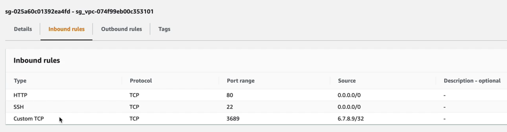
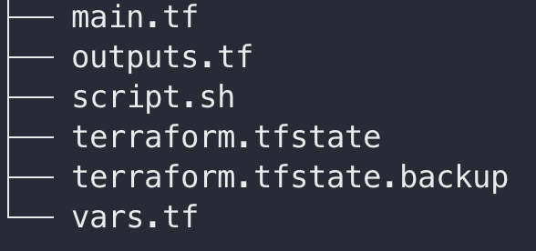
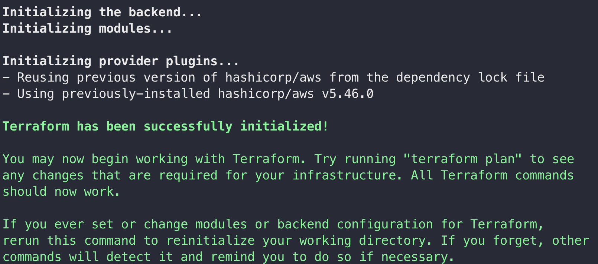
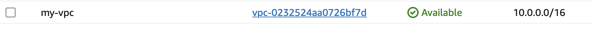
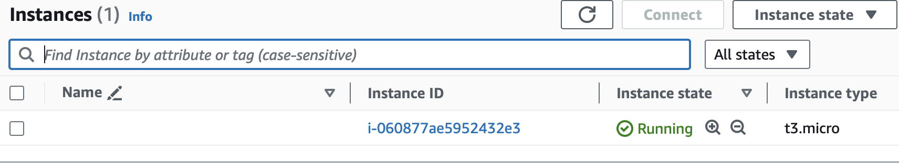
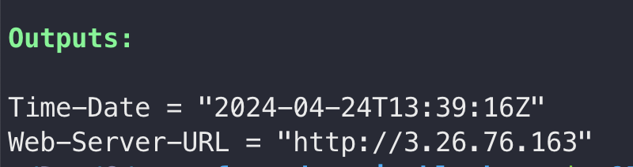
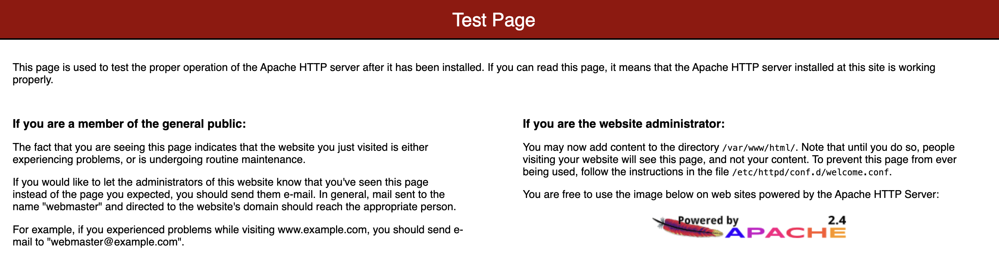

## Index

- [Summary](#summary)
- [Prereq](#prereq)
- [Terraform](#terraform)
- [Output](#output)
- [Destroy](#destroy)

## Summary

This project has the goal to show how terraform dynamic blocks work. <a href="https://developer.hashicorp.com/terraform/language/expressions/dynamic-blocks">Terraform Documentation</a>

Basically, it'll deploy an Apache Server and the security group will be set up using dynamic blocks.

```yaml
resource "aws_security_group" "my-sg" {
  vpc_id = module.vpc.vpc_id
  name   = join("_", ["sg", module.vpc.vpc_id])
  # it'll setup the ingress rules dynamically
  dynamic "ingress" {
    # loop the var files for each rule
    for_each = var.rules
    content {
      from_port   = ingress.value["port"]
      to_port     = ingress.value["port"]
      protocol    = ingress.value["proto"]
      cidr_blocks = ingress.value["cidr_blocks"]
    }
  }
  egress {
    from_port   = 0
    to_port     = 0
    protocol    = "-1"
    cidr_blocks = ["0.0.0.0/0"]
  }

  tags = {
    Name = "Terraform-Dynamic-SG"
  }
}
```

The `vars.tf` contains the list of settings to be setup on the Security Group in the above block of code.

```yaml
variable "rules" {
  type = list(object({
    port        = number
    proto       = string
    cidr_blocks = list(string)
  }))
  default = [
    {
      port        = 80
      proto       = "tcp"
      cidr_blocks = ["0.0.0.0/0"]
    },
    {
      port        = 22
      proto       = "tcp"
      cidr_blocks = ["0.0.0.0/0"]
    },
    {
      port        = 3689
      proto       = "tcp"
      cidr_blocks = ["6.7.8.9/32"]
    }
  ]
}
```

Once it's deployed the security group will be setup as shown below.



## Prereq

These tools were installed locally.

- <a href="https://docs.aws.amazon.com/cli/latest/userguide/cli-chap-install.html">AWS Cli</a>
- <a href="https://learn.hashicorp.com/tutorials/terraform/install-cli">Terraform</a>

## Terraform

**Terraform project**



### terraform init

Access the root folder and run `terraform init` to initialize the project.



### terraform validate

Access the root folder and run `terraform validate` to check whether the configuration is valid.

### terraform apply

Once it’s OK, run `terraform apply`

## Output

VPC Deployment


EC2 Instance


Terraform Output


Apache WebServer
Using the URL provided on the output as shown above, we can access the Apache Web Server


# Destroy

You can destroy your environment running the below command.

```bash
terraform destroy
```